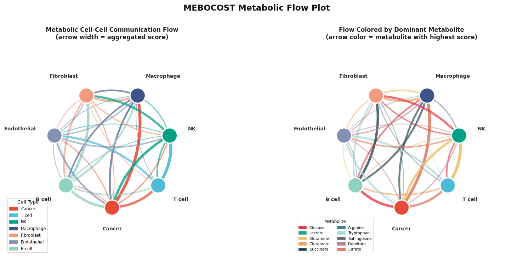

The MEBOCOST Metabolic Flow Plot (流图) is an innovative visualization developed within the **MEBOCOST** (Metabolite-mediated Cell Communication Prediction) framework. It depicts metabolite-mediated intercellular communication by rendering directed flow arrows between cell types, where the thickness and color of each flow encode the magnitude and direction of predicted metabolic signaling.

Unlike conventional cell-cell communication tools that focus solely on protein ligand-receptor pairs, MEBOCOST explicitly models small metabolites (e.g., lipids, amino acids, sugars) as signaling molecules. The flow plot integrates:

-   **Sender cells** (metabolite producers) and **receiver cells** (metabolite sensor-expressing cells)
-   **Communication score** mapped to arrow width and opacity
-   **Metabolite identity** optionally color-coded on edges

This chart is particularly suited for studying metabolic crosstalk in tumor microenvironments, tissue development, and metabolic disease contexts where small-molecule signaling complements protein-based communication.

## Example

{fig-alt="MEBOCOST Flow Plot DEMO" fig-align="center" width="60%"}

## Setup

-   System Requirements: Cross-platform (Linux/MacOS/Windows)

-   Programming Language: R (primary) / Python (MEBOCOST backend)

-   Dependencies: `MEBOCOST`, `ggplot2`, `dplyr`, `ggraph`, `igraph`, `tidygraph`

::: callout-note
MEBOCOST has both Python and R interfaces. The R wrapper (`MEBOCOST`) calls the Python back-end internally. If you prefer the pure Python workflow, see the [MEBOCOST Python documentation](https://wwylab.github.io/mebocost/).
:::

```{r packages setup, message=FALSE, warning=FALSE, output=FALSE}
# Install CRAN dependencies
for (pkg in c("ggplot2", "dplyr", "ggraph", "igraph", "tidygraph",
              "patchwork", "scales", "RColorBrewer")) {
  if (!requireNamespace(pkg, quietly = TRUE)) install.packages(pkg)
}

# Install MEBOCOST R package from GitHub
if (!requireNamespace("MEBOCOST", quietly = TRUE)) {
  if (!requireNamespace("devtools", quietly = TRUE)) install.packages("devtools")
  devtools::install_github("kaifuchenlab/MEBOCOST", subdir = "R")
}

# Load packages
library(ggplot2)
library(dplyr)
library(ggraph)
library(igraph)
library(tidygraph)
library(patchwork)
library(scales)
```

```{r session info}
sessioninfo::session_info("attached")
```

## Data Preparation

### 1. Overview of the MEBOCOST Workflow (Reference)

A typical MEBOCOST analysis proceeds as follows:

```{r upstream workflow}
#| eval: false
#| echo: true

library(MEBOCOST)

# Step 1: Load scRNA-seq expression data and metadata
data_input <- readRDS("your_scRNA_normalized.rds")   # genes × cells matrix
cell_meta  <- read.csv("your_cell_metadata.csv")     # cell type annotation

# Step 2: Run MEBOCOST inference
# MEBOCOST predicts metabolite production (enzymes) and sensing (transporters/GPCRs)
mebo_result <- mebocost_flow(
  data     = data_input,
  meta     = cell_meta,
  group.by = "cell_type",
  species  = "human"     # or "mouse"
)

# Step 3: The result contains a communication table:
# sender | receiver | metabolite | score | p.value
head(mebo_result@communication)
```

### 2. Load Example Data

For this tutorial we prepare a synthetic communication table that mirrors the MEBOCOST output format, keeping the example fully self-contained.

```{r load data, message=FALSE, warning=FALSE}
# Attempt to download a pre-built MEBOCOST result from Bizard data repository
mebo_url   <- "https://bizard-1301043367.cos.ap-guangzhou.myqcloud.com/MEBOCOST_example.rds"
local_rds  <- tempfile(fileext = ".rds")

download_ok <- tryCatch({
  download.file(mebo_url, local_rds, quiet = TRUE)
  file.exists(local_rds) && file.size(local_rds) > 1000
}, error = function(e) FALSE)

if (download_ok) {
  mebo_comm <- readRDS(local_rds)
  message("Loaded pre-built MEBOCOST example.")
} else {
  # Fallback: simulate a realistic communication table
  message("Using simulated MEBOCOST communication data for demonstration.")
  
  set.seed(2024)
  cell_types  <- c("Cancer", "T cell", "NK", "Macrophage",
                   "Fibroblast", "Endothelial", "B cell")
  metabolites <- c("Glucose", "Lactate", "Glutamine", "Glutamate",
                   "Succinate", "Arginine", "Tryptophan", "Sphingosine",
                   "Palmitate", "Citrate")
  
  n_pairs <- 60
  mebo_comm <- data.frame(
    sender     = sample(cell_types,  n_pairs, replace = TRUE),
    receiver   = sample(cell_types,  n_pairs, replace = TRUE),
    metabolite = sample(metabolites, n_pairs, replace = TRUE),
    score      = runif(n_pairs, 0.1, 1.0),
    p_value    = runif(n_pairs, 0.001, 0.05)
  ) %>%
    filter(sender != receiver) %>%          # remove self-loops
    group_by(sender, receiver, metabolite) %>%
    summarise(score = mean(score),
              p_value = min(p_value),
              .groups = "drop")
  
  message(sprintf("Simulated %d sender-receiver-metabolite triplets.", nrow(mebo_comm)))
}

head(mebo_comm)
```

### 3. Aggregate Communication Scores

```{r aggregate scores, message=FALSE}
# Aggregate across metabolites: total communication score between each cell pair
agg_comm <- mebo_comm %>%
  group_by(sender, receiver) %>%
  summarise(
    total_score   = sum(score),
    n_metabolites = n_distinct(metabolite),
    .groups       = "drop"
  ) %>%
  arrange(desc(total_score))

head(agg_comm)
```

## Visualization

### 1. Basic Flow Plot (Arrow Network)

The basic flow plot uses `ggraph` to draw directed arrows between sender and receiver cell types. Arrow width encodes total communication score.

```{r fig1-flow-basic, fig.width=8, fig.height=7, warning=FALSE}
#| fig-cap: "Basic MEBOCOST Metabolic Flow Plot"
#| out.width: "85%"

# Build graph object
g_basic <- graph_from_data_frame(
  d        = agg_comm %>% rename(weight = total_score),
  directed = TRUE,
  vertices = data.frame(name = unique(c(agg_comm$sender, agg_comm$receiver)))
)

set.seed(42)
p1 <- ggraph(g_basic, layout = "circle") +
  geom_edge_arc(
    aes(width = weight, alpha = weight),
    arrow       = arrow(length = unit(3, "mm"), type = "closed"),
    end_cap     = circle(6, "mm"),
    start_cap   = circle(6, "mm"),
    color       = "#3a86ff",
    curvature   = 0.2
  ) +
  geom_node_point(size = 12, color = "#ffbe0b", shape = 21,
                  fill = "#fb5607", stroke = 1.5) +
  geom_node_label(aes(label = name), repel = FALSE, size = 3.2,
                  fontface = "bold", color = "white",
                  fill = NA, label.size = 0) +
  scale_edge_width_continuous(range = c(0.5, 4), name = "Total Score") +
  scale_edge_alpha_continuous(range = c(0.3, 1), guide = "none") +
  labs(
    title    = "Metabolic Cell-Cell Communication Flow",
    subtitle = "Arrow width = aggregated communication score"
  ) +
  theme_graph(base_family = "sans") +
  theme(
    plot.title    = element_text(size = 14, face = "bold", hjust = 0.5),
    plot.subtitle = element_text(size = 10, hjust = 0.5),
    legend.position = "bottom"
  )

p1
```

### 2. Flow Plot Colored by Top Metabolite

Color each arrow by the identity of the metabolite with the highest communication score for that cell pair.

```{r fig2-flow-colored, fig.width=9, fig.height=8, warning=FALSE}
#| fig-cap: "Flow Plot Colored by Dominant Metabolite"
#| out.width: "85%"

# Find dominant metabolite for each sender-receiver pair
dominant_meta <- mebo_comm %>%
  group_by(sender, receiver) %>%
  slice_max(score, n = 1, with_ties = FALSE) %>%
  ungroup() %>%
  select(sender, receiver, metabolite, score)

# Select top metabolites for legible legend
top_metabolites <- dominant_meta %>%
  count(metabolite, sort = TRUE) %>%
  slice_head(n = 8) %>%
  pull(metabolite)

dominant_meta <- dominant_meta %>%
  mutate(
    meta_label = if_else(metabolite %in% top_metabolites,
                         metabolite, "Other")
  )

# Build graph
g_meta <- graph_from_data_frame(
  d        = dominant_meta %>% rename(weight = score),
  directed = TRUE,
  vertices = data.frame(name = unique(c(dominant_meta$sender, dominant_meta$receiver)))
)

# Add metabolite edge attribute
E(g_meta)$meta_label <- dominant_meta$meta_label

# Color palette
n_meta   <- length(unique(dominant_meta$meta_label))
pal_meta <- c(RColorBrewer::brewer.pal(min(n_meta, 9), "Set1"),
              "grey70")[seq_len(n_meta)]

set.seed(42)
p2 <- ggraph(g_meta, layout = "circle") +
  geom_edge_arc(
    aes(width = weight, color = meta_label, alpha = weight),
    arrow     = arrow(length = unit(3, "mm"), type = "closed"),
    end_cap   = circle(6, "mm"),
    start_cap = circle(6, "mm"),
    curvature = 0.2
  ) +
  geom_node_point(size = 14, shape = 21,
                  fill = "#4361ee", color = "white", stroke = 2) +
  geom_node_label(aes(label = name), size = 3,
                  fontface = "bold", color = "white",
                  fill = NA, label.size = 0) +
  scale_edge_width_continuous(range = c(0.5, 4), name = "Score") +
  scale_edge_alpha_continuous(range = c(0.4, 1), guide = "none") +
  scale_edge_color_manual(values = pal_meta, name = "Metabolite") +
  labs(
    title    = "Metabolic Flow Colored by Dominant Metabolite",
    subtitle = "Arrow color = metabolite with highest communication score"
  ) +
  theme_graph(base_family = "sans") +
  theme(
    plot.title    = element_text(size = 14, face = "bold", hjust = 0.5),
    plot.subtitle = element_text(size = 10, hjust = 0.5),
    legend.position = "right"
  )

p2
```

### 3. Flow Bubble Summary Plot

An alternative representation uses a bubble matrix where rows are senders, columns are receivers, and bubble size encodes communication strength.

```{r fig3-bubble-summary, fig.width=8, fig.height=6, warning=FALSE}
#| fig-cap: "Communication Bubble Summary Matrix"
#| out.width: "80%"

p3 <- ggplot(agg_comm,
       aes(x = receiver, y = sender,
           size = total_score, color = n_metabolites)) +
  geom_point(alpha = 0.8) +
  scale_size_continuous(name = "Total Score", range = c(2, 14)) +
  scale_color_gradient(
    name  = "# Metabolites",
    low   = "#90e0ef",
    high  = "#03045e"
  ) +
  theme_bw(base_size = 11) +
  theme(
    axis.text.x    = element_text(angle = 45, hjust = 1),
    panel.grid.major = element_line(color = "grey90"),
    plot.title     = element_text(size = 13, face = "bold", hjust = 0.5)
  ) +
  labs(
    title = "Metabolic Communication Bubble Matrix",
    x     = "Receiver Cell Type",
    y     = "Sender Cell Type"
  )

p3
```

### 4. Top Sender/Receiver Bar Charts

Identify which cell types are the most active senders and receivers.

```{r fig4-bar-charts, fig.width=10, fig.height=5, warning=FALSE}
#| fig-cap: "Top Senders and Receivers by Metabolic Communication"
#| out.width: "95%"

# Top senders
p_sender <- agg_comm %>%
  group_by(sender) %>%
  summarise(outgoing = sum(total_score), .groups = "drop") %>%
  arrange(desc(outgoing)) %>%
  ggplot(aes(x = reorder(sender, outgoing), y = outgoing, fill = outgoing)) +
  geom_col(width = 0.7, color = "white") +
  scale_fill_gradient(low = "#caf0f8", high = "#0077b6", guide = "none") +
  coord_flip() +
  theme_classic(base_size = 11) +
  labs(title = "Top Senders", x = NULL, y = "Total Outgoing Score")

# Top receivers
p_receiver <- agg_comm %>%
  group_by(receiver) %>%
  summarise(incoming = sum(total_score), .groups = "drop") %>%
  arrange(desc(incoming)) %>%
  ggplot(aes(x = reorder(receiver, incoming), y = incoming, fill = incoming)) +
  geom_col(width = 0.7, color = "white") +
  scale_fill_gradient(low = "#ffd6a5", high = "#f77f00", guide = "none") +
  coord_flip() +
  theme_classic(base_size = 11) +
  labs(title = "Top Receivers", x = NULL, y = "Total Incoming Score")

p_sender + p_receiver
```

### 5. Heatmap of Metabolite-Level Communication

Visualize communication at metabolite resolution to identify the most prominent metabolic signals.

```{r fig5-metabolite-heatmap, fig.width=10, fig.height=7, warning=FALSE}
#| fig-cap: "Metabolite-Level Communication Heatmap"
#| out.width: "90%"

# Create a pair label for each sender-receiver combination
heat_data <- mebo_comm %>%
  mutate(pair = paste(sender, "→", receiver)) %>%
  group_by(pair, metabolite) %>%
  summarise(score = sum(score), .groups = "drop")

# Keep top pairs and metabolites for readability
top_pairs <- heat_data %>%
  group_by(pair) %>%
  summarise(total = sum(score), .groups = "drop") %>%
  slice_max(total, n = 12) %>%
  pull(pair)

top_metas <- heat_data %>%
  group_by(metabolite) %>%
  summarise(total = sum(score), .groups = "drop") %>%
  slice_max(total, n = 10) %>%
  pull(metabolite)

heat_sub <- heat_data %>%
  filter(pair %in% top_pairs, metabolite %in% top_metas)

ggplot(heat_sub,
       aes(x = metabolite, y = pair, fill = score)) +
  geom_tile(color = "white", linewidth = 0.4) +
  scale_fill_gradient2(
    name   = "Score",
    low    = "white",
    mid    = "#ffb3c6",
    high   = "#d00000",
    midpoint = median(heat_sub$score)
  ) +
  theme_minimal(base_size = 11) +
  theme(
    axis.text.x   = element_text(angle = 45, hjust = 1),
    panel.grid    = element_blank(),
    plot.title    = element_text(size = 13, face = "bold", hjust = 0.5)
  ) +
  labs(
    title = "Metabolite-Level Communication Heatmap",
    x     = "Metabolite",
    y     = "Sender → Receiver"
  )
```

## References

\[1\] Chen K, et al. MEBOCOST: metabolite-mediated cell communication modeling by single cell transcriptome. *bioRxiv*. 2022. <https://doi.org/10.1101/2022.05.30.494067>

\[2\] MEBOCOST GitHub: <https://github.com/kaifuchenlab/MEBOCOST>

\[3\] MEBOCOST Documentation: <https://wwylab.github.io/mebocost/>

\[4\] Demo Notebook: <https://github.com/kaifuchenlab/MEBOCOST/blob/main/Demo_Communication_Prediction.ipynb>
